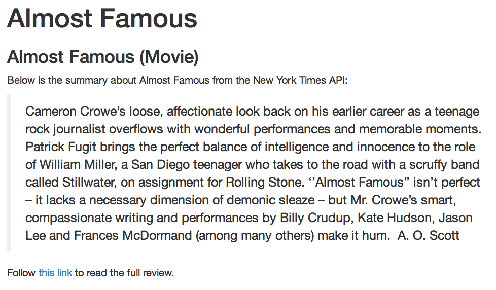

# Exercise-1
In this exercise, you'll practice building a dynamic report using the [New York Times API](https://developer.nytimes.com/) to fetch movie reviews. To learn more about the API, see the [developer console](https://developer.nytimes.com/movie_reviews_v2.json). The dynamic report you'll be building will look like this:

Begin by creating a new R Markdown file called `index.Rmd`, and do the following:

## Code block
In an R code block that is _executed but not displayed_ to the user, you should do the following:
- Store the name of a (popular) movie in a variable `movie`
- Create a new variable `movie.info` by passing your `movie` variable into a function that retrieves information from the NYT API (more instructions in the `exercise.R`) file

## Markdown
After your code block, you should use R Markdown syntax to reference the variables that you created above. Specifically, you should:

- Display the name of your movie (`movie`) in a **top-level header**
- Display the headline of the review in a **second-level header**
- Display the summary text of the review in a **blockquote**
- Provide a **link** to the full movie review

## Knitting
Once you've done these steps, you should `knit` your document to create a file `index.html`.

As in previous exercises, you should fork and clone this repository, follow the instructions in `exercise.R` file, then `add` and `commit` your changes so that you can `push` them back up to Github.
